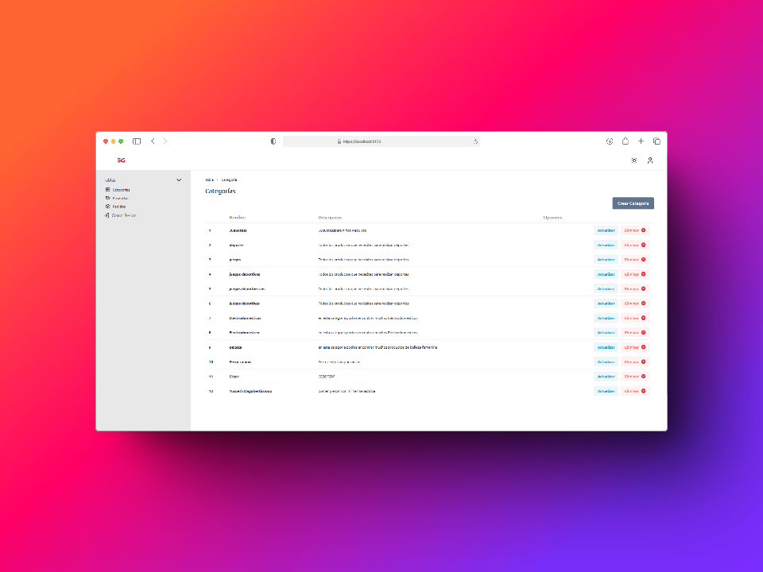

# Red 5G Gestión

Red 5G Gestión es una plataforma diseñada para la administración y monitoreo de redes 5G. Utiliza tecnologías modernas como React y Tailwind.




# Instalación y configuración


### Instrucciones para ejecutar el servidor Flask


### Pasos de ejecución

1. Entrar a la carpeta flask-backend
   ```bash
   cd flask-backend
   ```

2. Ejecutar el siguiente comando para iniciar el servidor Flask
   ```bash
   python -m flask --app index.py run --debug
   ```

3. Dejar la ventana, terminal o consola abierta para ejecutar las peticiones

# Instrucciones para ejecutar el Frontend

### Requisitos previos para frontend
- Tener [Node.js](https://nodejs.org/) instalado
- Tener npm (gestor de paquetes de Node.js) instalado

## Estructura del proyecto
El __Frontend__ se encuentra en la carpeta base del proyecto:
```
gestion/
├── flask-backend/
│   └── ... 
├── src/
├── public/
├── package.json
└── ...
```

## Pasos de ejecución

1. Navegar a la carpeta del frontend (desde la raíz del proyecto)
   ```bash
   cd frontend
   ```

2. Instalar dependencias y paquetes
   ```bash
   npm install
   ```

3. Ejecutar el frontend en modo Desarrollo
   ```bash
   npm run dev
   ```

## Notas importantes
- La aplicación de desarrollo normalmente se ejecutará en `http://localhost:3000/` o en el primer puerto disponible
- Los cambios en el código se reflejarán automáticamente en el navegador gracias al hot-reload


## Notas importantes
- El modo `--debug` permite que el servidor se reinicie automáticamente cuando detecta cambios en los archivos
- Asegúrate de tener Flask instalado (`pip install flask`)
- El servidor estará disponible en `http://127.0.0.1:5000/` por defecto


### Requisitos previos
- Node.js y npm instalados
- Python 3.x instalado
- XAMPP instalado y configurado

